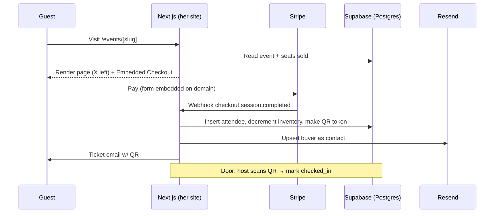

# Nana Ticketing — Product Requirements Document

*On-brand, native ticket sales for Chef Nana's pop-ups. Built on Next.js + Stripe. Written for Claude Code.*

---

## Executive Summary

Build a native ticketing flow on Chef Nana's existing Next.js/React site so guests buy pop-up tickets without ever leaving her domain. Stripe **Embedded Checkout** handles payment on-brand, a lightweight Postgres backend enforces per-event capacity and stores the attendee list, and a QR-based host view handles door check-in. Buyers sync to Resend so Nana can email attendees directly.

## Problem Statement

Nana already has Tock, but Tock sends traffic *off* her site to a Tock-hosted page and takes ~3% in fees. Her stated goal is a **more direct way that drives people to the website**. She needs ticket sales that live natively under her own branding, keep guests on the domain, capture who's coming, and let her check people in at the door — with fees no worse than the ~3% she pays Tock today.

## Solution Overview

A single Next.js app (her existing site) gains four pieces:

1. **Event pages** with an embedded Stripe checkout — fully on her domain and styling.
2. **A Postgres backend** (Supabase) as source of truth for events, capacity, and orders.
3. **A Stripe webhook** that confirms payment, decrements inventory, creates the attendee record with a unique QR token, emails a ticket, and pushes the buyer into Resend.
4. **A host check-in view** — scan a QR or search a name, mark the guest arrived.

Plain Stripe Payment Links were the first instinct but they render on a Stripe-hosted page, which breaks the "native and on-brand" goal. Embedded Checkout keeps the payment form inside her site. Capacity + door check-in both need server-side state, so a small DB is required either way — that's where the attendee list naturally lives.

## Target Users

**Primary — Guests:** Buy a ticket to a specific pop-up from Nana's site. Want a fast, trustworthy checkout and a ticket they can show at the door.

**Secondary — Nana / door staff:** Publish an event with a seat cap, watch sales, check guests in, and email the attendee list afterward.

## Core Features

### Phase 1: MVP (Week 1)

| Feature | Description | Priority | Complexity |
|---------|-------------|----------|------------|
| Event page | Public page per pop-up: title, date, price, description, image, live "X seats left" | P0 | Low |
| Embedded checkout | Stripe Embedded Checkout mounted on-site, on-brand | P0 | Med |
| Capacity enforcement | Block/close sales when an event hits its seat cap | P0 | Med |
| Webhook + attendee record | On paid, store buyer, generate QR token, decrement inventory | P0 | Med |
| Ticket email | Confirmation email with QR + event details via Resend | P0 | Low |
| Sold-out state | Event page shows sold out and disables checkout at cap | P0 | Low |

### Phase 2: Door + Ops (Week 2)

| Feature | Description | Priority | Complexity |
|---------|-------------|----------|------------|
| Check-in view | Password-gated host page: scan QR or search name, mark arrived | P0 | Med |
| Resend contact sync | Push each buyer into a Resend audience for post-event email | P1 | Low |
| Simple admin | Create/edit events, set capacity and price, view sales | P1 | Med |
| Refund handling | Webhook on refund frees a seat, voids the ticket | P1 | Low |

### Phase 3: Nice-to-haves (later)

| Feature | Description | Priority | Complexity |
|---------|-------------|----------|------------|
| Multiple ticket tiers | GA / VIP / table pricing per event | P2 | Med |
| Quantity per order | Buy 2–6 seats in one checkout | P2 | Med |
| Waitlist | Collect emails once sold out, notify on release | P2 | Med |
| Promo codes | Discount codes via Stripe Coupons | P2 | Low |
| Apple/Google Wallet pass | Add-to-wallet ticket instead of email QR | P2 | High |

## Technical Architecture

### System Overview



### Tech Stack

| Layer | Technology | Rationale |
|-------|------------|-----------|
| Frontend | Next.js (App Router) + React + Tailwind | Her site already runs this — new routes drop in, no new framework, checkout renders under her styling |
| Payments | Stripe Embedded Checkout + Webhooks | Embedded keeps the payment form on her domain (the whole point); Stripe fees ~2.9% + 30¢ ≈ her current Tock rate |
| Backend | Next.js Route Handlers (`/app/api/*`) | No separate server to run — API routes live in the same repo and deploy on Vercel |
| Database | Supabase (Postgres) | Managed Postgres with a generous free tier, row-level transactions for capacity, and a client SDK. Source of truth for events, orders, attendees |
| Email | Resend | Already her newsletter tool — reuse for ticket confirmations and attendee sync, one vendor |
| Auth (host view) | Single shared passcode env var (MVP) → Supabase Auth (later) | Door check-in needs a gate, not full user accounts, for launch |
| Hosting | Vercel | Native Next.js host, free tier fine at this volume, webhook endpoint is just a route |

### Data Model

```
events
  id              uuid pk
  slug            text unique        -- /events/summer-jollof
  title           text
  description     text
  event_date      timestamptz
  location        text
  price_cents     int
  currency        text default 'usd'
  capacity        int
  image_url       text
  status          text               -- draft | published | sold_out | closed
  stripe_price_id text               -- optional, or price built inline
  created_at      timestamptz default now()

attendees
  id              uuid pk
  event_id        uuid fk -> events
  name            text
  email           text
  quantity        int default 1
  stripe_session  text unique        -- idempotency guard
  qr_token        text unique        -- signed/random, encodes to QR
  checked_in      bool default false
  checked_in_at   timestamptz
  refunded        bool default false
  created_at      timestamptz default now()

-- seats sold for an event = sum(quantity) of non-refunded attendees
-- seats left = events.capacity - seats sold
```

### API Specifications

| Route | Method | Purpose |
|-------|--------|---------|
| `/api/checkout` | POST | Body `{ eventId }`. Re-check capacity, create Stripe Checkout Session (`ui_mode: 'embedded'`), return `client_secret` |
| `/api/stripe/webhook` | POST | Verify signature, handle `checkout.session.completed` and `charge.refunded`. Idempotent on `stripe_session` |
| `/api/checkin` | POST | Body `{ qr_token }` + host passcode header. Validate, flip `checked_in`, return attendee |
| `/api/events` (admin) | GET/POST | List and create events |

### Capacity — the one race condition to get right

Two guests can pay for the last seat at the same moment. Handle it in this order:

1. **Soft check at session creation** (`/api/checkout`): reject early if already at cap — cheap, catches most cases.
2. **Hard check at the webhook** inside a Postgres transaction: `SELECT capacity, sum(quantity) ... FOR UPDATE`, and if the new order would exceed cap, **auto-refund** that Stripe session and email an apology instead of confirming. The webhook is the source of truth since it fires after money actually moves.
3. Mark the event `sold_out` when seats sold hits capacity so the page stops offering checkout.

This is a real edge case for small-cap dinners (e.g. 20 seats) — worth the transaction.

### Third-Party Integrations

| Service | Purpose | Cost |
|---------|---------|------|
| Stripe | Payments, checkout, refunds | 2.9% + 30¢ per successful charge (US card, verify current rate) — no monthly fee |
| Supabase | Postgres DB + client SDK | Free tier covers this volume; ~$25/mo Pro if it grows |
| Resend | Ticket emails + attendee contacts | Already owned; free tier is 3k emails/mo, 100/day |
| Vercel | Hosting the Next.js app | Already hosting her site; free/Hobby fine at launch |

## User Flows

### Buy a ticket
1. Guest lands on `/events/summer-jollof` from the newsletter or homepage.
2. Page shows date, price, and "12 of 20 seats left."
3. Guest clicks **Get tickets** — Stripe Embedded Checkout expands inline on the page.
4. Guest enters card details without leaving nana's domain and pays.
5. Webhook confirms, creates the attendee + QR, decrements inventory.
6. Guest gets a ticket email with a QR code and event details.

### Check in at the door
1. Host opens `/checkin`, enters the shared passcode.
2. Host scans the guest's QR (phone camera) or types their name.
3. Screen shows the guest, marks them arrived, and blocks double-scans.

### Sold out
1. Seats sold hits capacity; event flips to `sold_out`.
2. Event page swaps the checkout for a "Sold out" state (Phase 3: waitlist email capture).

## File Structure (drop into her existing Next.js repo)

```
app/
  events/
    [slug]/
      page.tsx            # event page, reads DB, renders <Checkout/>
  checkin/
    page.tsx              # host check-in view (passcode-gated)
  api/
    checkout/route.ts     # create embedded checkout session
    stripe/
      webhook/route.ts    # verify + fulfill, capacity transaction, refund-on-overflow
    checkin/route.ts      # validate QR, mark arrived
    events/route.ts       # admin list/create
components/
  Checkout.tsx            # mounts Stripe Embedded Checkout
  SeatsLeft.tsx           # live availability badge
lib/
  stripe.ts               # server Stripe client
  supabase.ts             # server + browser clients
  resend.ts               # send ticket email, upsert contact
  qr.ts                   # generate + verify QR token
```

### Packages

```bash
npm install stripe @stripe/stripe-js @stripe/react-stripe-js \
  @supabase/supabase-js resend qrcode
# pin: stripe@^17, @stripe/stripe-js@^4, @supabase/supabase-js@^2, resend@^4
```

### Env vars

```
STRIPE_SECRET_KEY=
NEXT_PUBLIC_STRIPE_PUBLISHABLE_KEY=
STRIPE_WEBHOOK_SECRET=
NEXT_PUBLIC_SUPABASE_URL=
SUPABASE_SERVICE_ROLE_KEY=      # server only, never client
RESEND_API_KEY=
CHECKIN_PASSCODE=               # shared door passcode for MVP
```

### Reference snippets

**Create the embedded session — `app/api/checkout/route.ts`**
```ts
import { NextRequest, NextResponse } from 'next/server';
import { stripe } from '@/lib/stripe';
import { supabaseAdmin } from '@/lib/supabase';

export async function POST(req: NextRequest) {
  const { eventId } = await req.json();

  const { data: event } = await supabaseAdmin
    .from('events').select('*').eq('id', eventId).single();
  if (!event || event.status !== 'published') {
    return NextResponse.json({ error: 'unavailable' }, { status: 400 });
  }

  const { data: sold } = await supabaseAdmin
    .rpc('seats_sold', { p_event: eventId });   // sum(quantity) non-refunded
  if ((sold ?? 0) >= event.capacity) {
    return NextResponse.json({ error: 'sold_out' }, { status: 409 });
  }

  const session = await stripe.checkout.sessions.create({
    ui_mode: 'embedded',
    mode: 'payment',
    line_items: [{
      price_data: {
        currency: event.currency,
        unit_amount: event.price_cents,
        product_data: { name: event.title },
      },
      quantity: 1,
    }],
    metadata: { event_id: eventId },
    return_url: `${process.env.NEXT_PUBLIC_SITE_URL}/events/${event.slug}/confirmed?session_id={CHECKOUT_SESSION_ID}`,
  });

  return NextResponse.json({ clientSecret: session.client_secret });
}
```

**Fulfill with a capacity guard — `app/api/stripe/webhook/route.ts`**
```ts
// Verify signature with STRIPE_WEBHOOK_SECRET, then on checkout.session.completed:
// 1. Idempotency: skip if attendees already has this stripe_session
// 2. BEGIN transaction, lock event row, recount seats_sold
// 3. If sold + qty > capacity  -> stripe.refunds.create(...) + apology email, return
// 4. Else insert attendee (name/email from session), generate qr_token
// 5. If now at capacity -> update event.status = 'sold_out'
// 6. Send ticket email (Resend) + upsert Resend contact
// Return 200 fast; do heavy work idempotently since Stripe retries.
```

## Non-Functional Requirements

### Performance
- Event page loads < 1s (static shell + a single seats-left query).
- Webhook responds < 5s so Stripe does not retry unnecessarily.
- Handles a launch spike of ~50 concurrent buyers on a 20–100 seat drop.

### Security
- Verify every webhook with `STRIPE_WEBHOOK_SECRET` — reject unsigned calls.
- `SUPABASE_SERVICE_ROLE_KEY` server-side only; never ships to the browser.
- QR token is random/signed, not a guessable sequential ID.
- Check-in gated by passcode for MVP; move to Supabase Auth before staff scales.
- No card data touches her server — Stripe handles all of it (PCI scope stays minimal).

### Scalability
- Postgres + Vercel functions carry far past current volume; the only real bottleneck is the per-event capacity lock, which is scoped to a single event row and fine for dinner-sized caps.

## Success Metrics

| Metric | Target | Measurement Method |
|--------|--------|-------------------|
| Checkout completion rate | > 80% of started checkouts | Stripe session started vs. completed |
| On-site conversion | Traffic buys without bouncing to Tock | Event page views → paid, in analytics |
| Oversell incidents | 0 | Count of refund-on-overflow events in DB |
| Check-in speed | < 10s per guest | Host feedback at first event |
| Fee vs Tock | ≤ Tock's ~3% | Stripe fees / gross per event |

## Cost Estimates

### Development
| Phase | Scope | Estimate |
|-------|-------|----------|
| MVP (Phase 1) | Event page, embedded checkout, webhook, capacity, ticket email | ~1–2 focused days in Claude Code |
| Phase 2 | Check-in view, Resend sync, admin, refunds | ~1–2 days |

### Operations (Monthly)
| Service | Cost |
|---------|------|
| Stripe | 2.9% + 30¢ per ticket (no fixed fee) |
| Supabase | $0 (free tier) → $25 if it grows |
| Resend | $0 (already owned) |
| Vercel | $0 (already hosting) |
| **Fixed total** | **~$0/mo at launch**, plus per-ticket Stripe fee |

## Risks & Mitigations

| Risk | Impact | Likelihood | Mitigation |
|------|--------|------------|------------|
| Two buyers grab the last seat | Med | Med | Webhook capacity transaction auto-refunds the overflow order |
| Webhook missed → guest pays, no ticket | High | Low | Stripe auto-retries; idempotent handler; a reconcile script re-reads Stripe sessions |
| Business banking still not connected | High | Med | Same blocker Tock had — Stripe collects immediately, pays out once bank verified. Confirm Stripe account + bank before the drop |
| Personal vs business banking on Stripe | Med | Med | Nana used personal banking on Tock; decide which to attach to Stripe before launch to avoid a payout freeze |
| Fraud / chargebacks on a public drop | Med | Low | Stripe Radar on by default; keep card-only, no manual entry |
| **Full failure: checkout broken at launch** | High | Low | Fall back to her existing Tock event page as a hot backup; keep the Tock link ready until the first drop clears cleanly |

## Timeline & Milestones

| Day | Milestone | Deliverable |
|-----|-----------|-------------|
| 1 | DB + payments | Supabase schema live, `/api/checkout` returns a client secret, event page renders embedded checkout |
| 1 | Fulfillment | Webhook creates attendees, decrements inventory, sends ticket email |
| 2 | Capacity + sold-out | Transaction guard + refund-on-overflow, sold-out state on the page |
| 2 | Door + sync | Check-in view working on a phone, Resend contact sync |
| 3 | Hardening | Refund flow, reconcile script, first real event dry-run |

## Open Questions
- [ ] **Stripe banking:** personal or business account, and is it verified for payouts? (Nana used personal banking on Tock.)
- [ ] **Ticket shape for launch:** single GA price per event enough, or does the first drop need tiers/quantities? (MVP assumes single price, qty 1.)
- [ ] **Check-in device:** whose phone runs the door view, and does the venue have signal/wifi for it?
- [ ] **Keep Tock live in parallel** for the first drop as a fallback, or cut over fully?
- [ ] **Refund policy** wording for the ticket email (all sales final vs. window).

## Appendix — Why not just embed Tock or use Payment Links

- **Tock embed:** still routes the transaction and the guest through Tock's system and branding, and does not satisfy "drive people to the website." Keep it as a launch-day fallback only.
- **Stripe Payment Links:** fastest to stand up but render on a Stripe-hosted `checkout.stripe.com` page — off-brand and off-domain. Rejected for the same native-experience reason. Embedded Checkout is the on-brand equivalent with the same fees.
